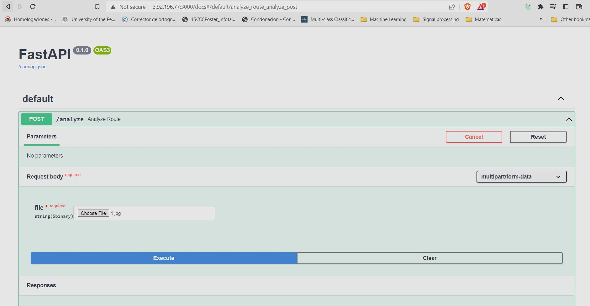
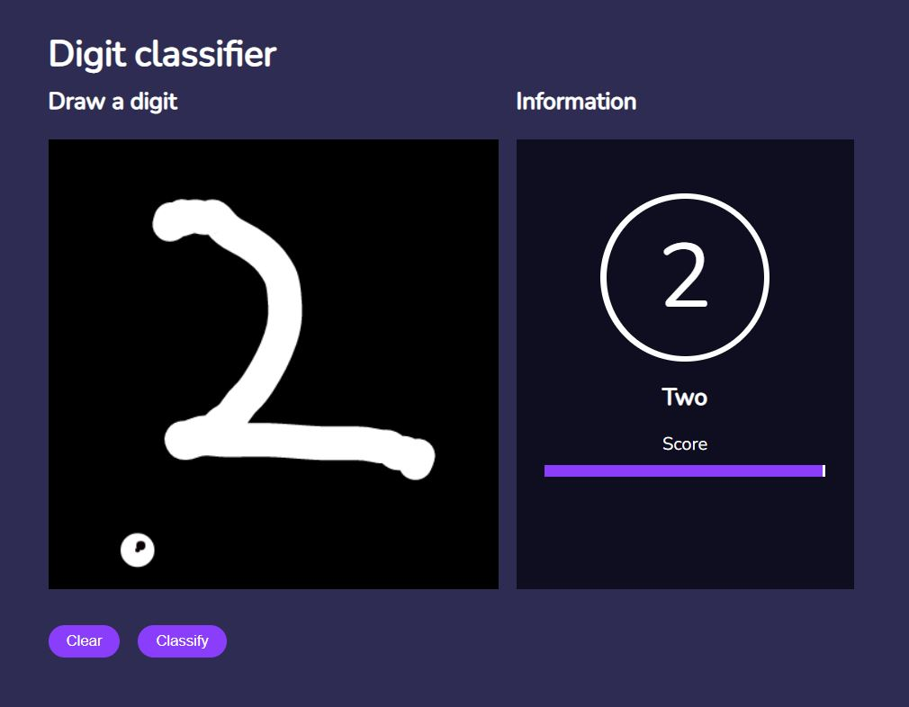
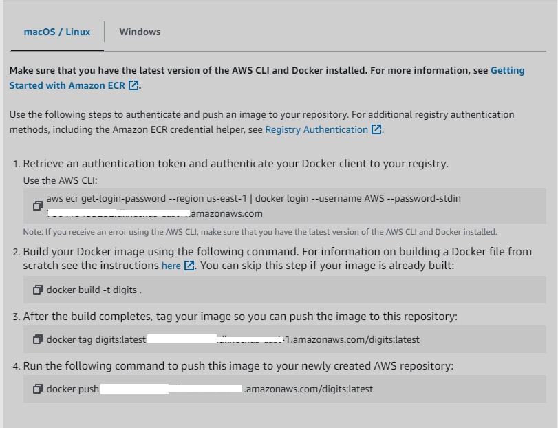

# 1) About the project

## 1.1) Problem

The MNIST dataset is considered the "Hello World" of computer vision. The MNIST database was created to provide a test bank for people who want to test pattern recognition methods or machine learning algorithms, classifying images to digits.

I consider this important to convert non-editable files, such as jpg, png and pdf into a editable text format.

#### Dataset Summary

The MNIST dataset consists of 70,000 28x28 black-and-white images of handwritten digits extracted from two NIST databases. There are 60,000 images in the training dataset and 10,000 images in the validation dataset, one class per digit so a total of 10 classes, with 7,000 images (6,000 train images and 1,000 test images) per class. Half of the image were drawn by Census Bureau employees and the other half by high school students (this split is evenly distributed in the training and testing sets).
source: https://huggingface.co/datasets/mnist

## 1.2) Results

### Deploying to AWS ECS in FastAPI




### Frontend APP


Video of Demo for the frontend:


### Metrics

| class | precision | recall | f1-score | support |
| :---- | :-------: | :----: | :------: | ------: |
| 0     |   0.94    |  0.98  |   0.96   |     980 |
| 1     |   0.97    |  0.98  |   0.98   |    1135 |
| 2     |   0.94    |  0.90  |   0.92   |    1032 |
| 3     |   0.90    |  0.92  |   0.91   |    1010 |
| 4     |   0.93    |  0.93  |   0.93   |     982 |
| 5     |   0.92    |  0.88  |   0.90   |     892 |
| 6     |   0.94    |  0.95  |   0.95   |     958 |
| 7     |   0.94    |  0.91  |   0.92   |    1028 |
| 8     |   0.89    |  0.89  |   0.89   |     974 |
| 9     |   0.91    |  0.91  |   0.91   |    1009 |

The model is very good in classifying between all the digits except slightly worse in classifying between digits 3 and 8.

### Development

- Create notebook for training model, data exploration and evaluation 
- Create a train.py script to re-train and save the best model 

### Production

- Export Keras model to tf-lite (Check digits.tflite)
- Create a virtual environment
- Create a dynamic frontend app for drawing digits
- Create docker container
- Serve using a FastAPI service

# 2) Contents of the folder

```
├── backend
│ ├── digits.tflite
│ ├── Dockerfile
│ ├── requirements.txt
│ ├── service.py
├── frontend
│ ├── public/*
│ ├── src/*
│ ├── package.json
├── notebook.ipynb
├── Pipfile
├── Pipfile.lock
├── train.py
└── predict.py
```

- Note: Dataset is internal to keras and is available for download using ```keras.datasets.mnist.load_data()```

# 3) Environment installation

### Clone project

Clone the project using

```
git clone 
```

Move to project

```
cd "Interactive-Digit-Classifier"
```

### Create virtual env

Create virtualenv

```
pipenv install
```

Activate virtualenv

```
pipenv shell
```

### Build service

Move to backend

```
cd backend
```

Build container

```
docker image build -t digits .
```

Run Container

```
docker run -it --rm -p 3000:3000 digits:latest
```

### Open interactive frontend (Optional)

Prerequisites: `npm or yarn`

Open folder

```
cd frontend
```

Build React App
`npm i ` or `yarn install`

Open frontend
`npm run start ` or `yarn start`

# 4) Run code

- If you want check EDA/Analysis/Train process run notebook.ipynb
- If you want retrain the model run `python train.py`
- If you want deploy a service run in app folder `uvicorn service:app --reload`
- If you want build the container run in app folder `docker run -it --rm -p 3000:3000 digits:latest`

# 6) Deploying FastAPI to AWS ECS

We need to create a docker image with BentoML

Most of the steps are done directly from AWS.

#### Create a ECR in AWS

Click in `view push command`

- Authentication
  `aws ecr get-login-password --region [your_region] | docker login --username AWS --password-stdin [your_url]`

- Note the `tag` of the dokcer image using
  `docker images`

- Tag the image
  `docker tag digits:latest:[`tag`] `your aws url` /digits:latest`

- Push image in aws with the `tag` of the image
  `docker push `your url`/digits:latest `

Note: You can check all commands in your aws account



#### Create a cluster in AWS ECS 

In AWS ECS:
- Create a cluster
- Create a task
- Attach image container to task
- Enable port 3000 in tcp
- Run the task
- Open the public url in port 3000
